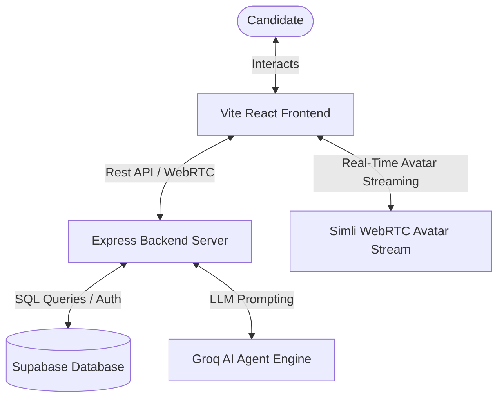

# ⚡ HireMind 🧠
### **"Not just mock. Your forever AI Interview Mentor who remembers everything."**

<p align="center">
  <a href="https://react.dev/"></a>
  <a href="https://vitejs.dev/"></a>
  <a href="https://tailwindcss.com/"></a>
  <a href="https://www.framer.com/motion/"></a>
  <a href="https://supabase.com/"></a>
  <a href="https://groq.com/"></a>
</p>

---

## 🌟 Welcome to HireMind

**HireMind** is a premium, multi-modal, agentic AI mock interview platform featuring a stunning **3D Liquid Glass Neumorphic** design. Built for job seekers who want to eliminate interview anxiety, HireMind tracks progress over time, evaluates resumes, runs multi-persona panel interviews, and provides comprehensive feedback.

---

## 📐 System Architecture

HireMind connects the client directly to the Express server, Groq LLM inference, and Supabase for persistent data storage and authentication:



---

## ✨ Features That Set Us Apart

HireMind delivers a comprehensive suite of preparation tools:

### 📑 1. ATS Resume Matcher & Audit (New!)
A full-width, step-based wizard that lets you benchmark your resume relevance against any job description:
- **PDF text parsing**: Drag and drop your PDF resume for instant structural parsing.
- **Concentric Rotating Loading Screen**: Dynamic progress indicators cycling through the analysis phases.
- **ATS Audit Dashboard**: View your visual match score progress ring, profile summary, missing keywords, and structured optimization roadmaps.
- **Smart Retake UX**: Re-analyze at any time; your job description text is retained to save you re-pasting on small edits.

### 🧠 2. Long-Term Memory Mentor
HireMind never forgets. The platform persists your historical mock performance, tracking strength trends and recurring weak spots across behavioral, situational, and technical sessions.

### 👥 3. Multi-Interviewer Panel Mode
Choose up to two specialized AI personas (e.g., *The Architect*, *The Executive*, or *The Debugger*) to face simultaneously in a multi-persona round, powered by Groq and real-time avatar setups.

### 🎙️ 4. Audio Coach Setup
Simulates real audio-first conversations. Practice speaking directly with the AI coach, preparing you for initial screeners and technical phone interviews.

### 📊 5. Progress Hub & Skill Map
Interactive charts tracking your average scores, weekly session counts, streak counters, and skill level profiles.

---

## 🎨 3D Liquid Glass Design System

Built to deliver visual excellence, the dashboard includes:
* **Liquid Glass Neumorphism**: Translucent frosted containers, deep 3D-like shadows, and elegant glassmorphic layouts.
* **Liquid Neumorphic Background**: Smooth, interactive ambient blue and violet backgrounds that dynamically shift as you navigate.
* **Cursor Glow Tracker**: Ambient light halo follows the mouse to illuminate buttons and inputs dynamically.
* **Smooth Spring Physics**: Micro-interactions, slide transitions, and rotation wheels powered by Framer Motion.

---

## 🚀 Getting Started

Follow these steps to spin up both the Frontend Client and the Backend Server locally.

### 📦 Prerequisites
- **Node.js** (v18 or higher)
- **npm** or **bun** / **yarn**

### 🔧 Setup Environment Variables

Create a `.env` file in the root directory:
```env
VITE_SUPABASE_URL=your_supabase_project_url
VITE_SUPABASE_ANON_KEY=your_supabase_anon_key
VITE_API_URL=http://localhost:3001/
```

Create a `.env` file in the `server` directory:
```env
PORT=3001
GROQ_API_KEY=your_groq_api_key
SUPABASE_URL=your_supabase_project_url
SUPABASE_SERVICE_ROLE_KEY=your_supabase_service_role_key
```

### 💻 Installation

1. **Clone the Repository:**
   ```bash
   git clone https://github.com/RaoSam-Code/vibeathon.git
   cd vibeathon
   ```

2. **Install Dependencies:**
   ```bash
   npm install
   cd server
   npm install
   cd ..
   ```

3. **Run in Development Mode:**
   You can start both the frontend Vite dev server and the backend Express server concurrently:
   ```bash
   npm run dev:all
   ```

4. **Access the Platform:**
   - **Frontend**: Open [http://localhost:8080/](http://localhost:8080/)
   - **API Server**: Runs on [http://localhost:3001/](http://localhost:3001/)

---

## 🛠 Tech Stack

### Frontend
- **React 18 & Vite** - Ultra-fast development and client builds.
- **Tailwind CSS** - Modern layouts with custom utility configurations.
- **Framer Motion** - Liquid physics, custom spring animations, and page transitions.
- **Recharts** - Dynamic performance progress tracking charts.
- **Lucide React** - Sleek, modern SVG icons.

### Backend
- **Express & Node.js** - Secure RESTful API routes.
- **Multer** - Memory storage file upload management.
- **pdf-parse** - Low-overhead raw text extraction from PDF buffers.
- **Groq LLM Engine** - High-speed, low-latency AI evaluations.
- **Supabase JS Client** - Real-time database synchronizations and candidate authentication.

---

<div align="center">
  <sub>Built with ❤️ by team Cyber Soulz. Optimize your prep, conquer your fears, and land the role.</sub>
</div>
